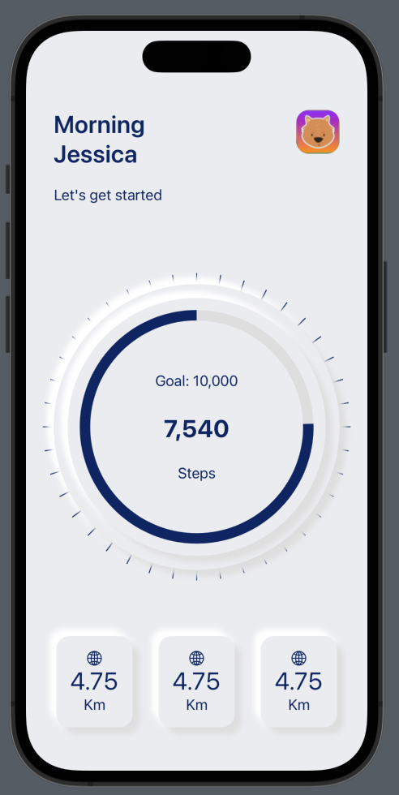
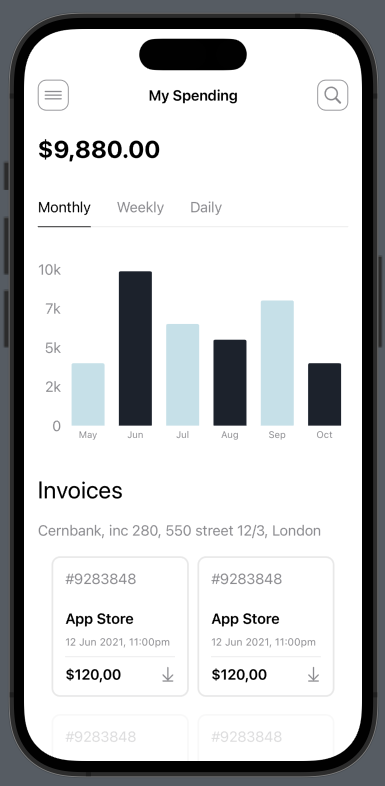

# SwiftUI-RECreations

Jan 19th 2023
---
#### Fitness App with a neomorphic design

- Use of shadows for shading and highlights.
- Use of SwiftUI shapes for progress view.
- Modular design. Take what you need and use it in your own app!

[Sourcecode](https://github.com/BeauNouvelle/SwiftUI-RECreations/tree/main/FitnessApp-Neo)

[Dribbble Design by Mayam](https://dribbble.com/shots/15978028-Banking-Dashboard-Mobile-View)
| [Designer Profile](https://dribbble.com/arcimaryam)

#### Budget App

- Custom Segmented Control with sliding underline animation
- Uses SwiftUI Charts

[Sourcecode](https://github.com/BeauNouvelle/SwiftUI-RECreations/tree/main/BudgetApp)

[Dribbble Design by Caglar Cebeci](https://dribbble.com/shots/15978028-Banking-Dashboard-Mobile-View) | [Designer Profile](https://dribbble.com/CaglarCebeci)

