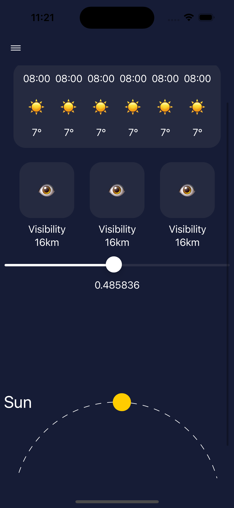
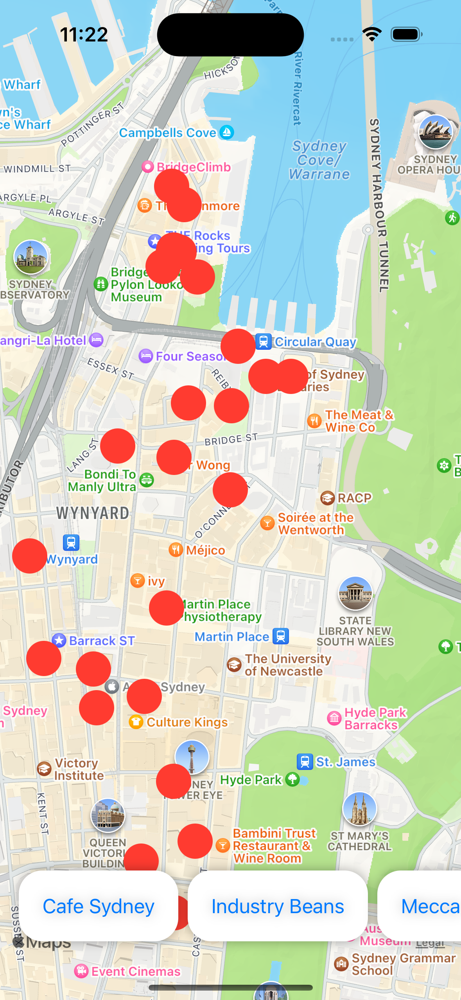
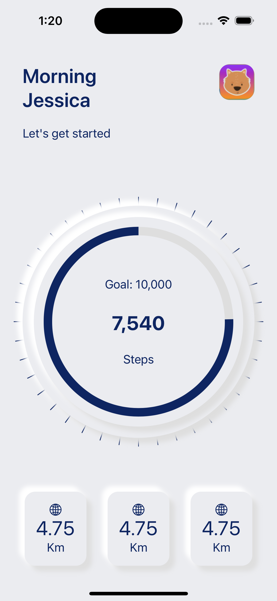

# SwiftUI-RECreations

Here you can find the source code from my live streams.
[YouTube](https://youtube.com/c/getswifty) | [Twitch](https://www.twitch.tv/basedbitstream)

I stream most days on both Twitch and YouTube, but the videos are archived on YouTube.
It may take some time before the links to the videos are updated here (esp if you're viewing this on the day)

I generally commit the code as I go on stream, so you can jump in here while it's all happened and take a look for yourself.
I hope you find some of this content useful and can use it in your own apps!

##### Please don't open pull requests with changes to the code!
At least not yet. The purpose is to keep this code AS IS so it matches what you see in the video uploads.

If there's a HUGE mistake and it hurts you to look at it, and it MUST be fixed.... create a PR but make sure the project with your fixes are in a copied folder of the original project with a suffix of "-fixed", and update the readme to ALSO link to this fixed folder.
All further PRs should be made on that same "-fixed" folder.

### Jan 20th 2023

------

#### Weather App

- Use of shapes and created a reusable sunrise/sunset visual

[Sourcecode](https://github.com/BeauNouvelle/SwiftUI-RECreations/tree/main/WeatherApp)

[Dribbble Design by Mayam](https://dribbble.com/shots/14901198-weather-app) | [Designer Profile](https://dribbble.com/arcimaryam)

#### Cafe Finder - MapKit

- Annotations
- Location Search
- Scroll to: on scrollview

[Sourcecode](https://github.com/BeauNouvelle/SwiftUI-RECreations/tree/main/CafeFinder)

### Jan 19th 2023

------
#### Fitness App with a neomorphic design

- Use of shadows for shading and highlights.
- Use of SwiftUI shapes for progress view.
- Modular design. Take what you need and use it in your own app!

[Sourcecode](https://github.com/BeauNouvelle/SwiftUI-RECreations/tree/main/FitnessApp-Neo)

[Dribbble Design by Mayam](https://dribbble.com/shots/15083711-Fitness-App)
| [Designer Profile](https://dribbble.com/arcimaryam)

#### Budget App

- Custom Segmented Control with sliding underline animation (matchedGeometryEffect)
- Uses SwiftUI Charts

[Sourcecode](https://github.com/BeauNouvelle/SwiftUI-RECreations/tree/main/BudgetApp)

[Dribbble Design by Caglar Cebeci](https://dribbble.com/shots/15978028-Banking-Dashboard-Mobile-View) | [Designer Profile](https://dribbble.com/CaglarCebeci)

